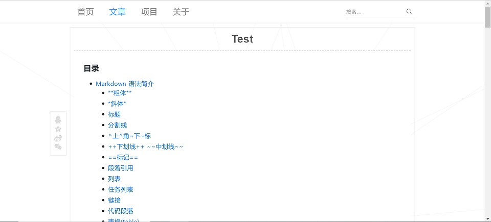
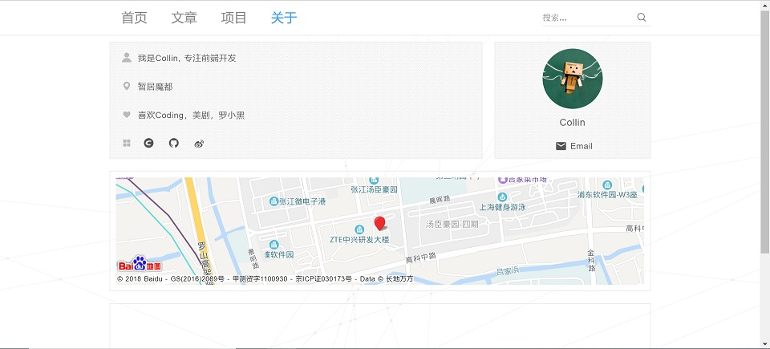

# blog

[](https://github.com/TJCollinZhang/blog-front-end/blob/master/LICENSE)


> 使用Vue+VueRouter开发的个人博客前端，分为博客管理界面`adimn`和博客展示界面`front`
博客后端地址：https://github.com/TJCollinZhang/blog-server
 - ElementUI作为管理界面框架
 - Axios统一前端请求和相应拦截处理
 - ScrollReveal页面初始动画
 - MavonEditor用于博客展示和编写
 - ... ...

> [Online Demo](blog.collinjs.site)

## 功能介绍
1. 博客文章编写与展示

  

  

2. 个人项目添加展示以及标签管理

  

  

  
3. 个人信息界面

  


## 运行及打包

``` bash
# install dependencies
npm install

# serve with hot reload at localhost:8080
npm run dev

# build for production with minification
# gzip打包且去掉sourceMap，尽可能减小打包后js体积
npm run build

```


## 后续待完成功能
 - 增加评论、点赞等功能
 - 增加首页加载动画
 - ... ...

## Thanks
页面布局大量参考了Naice大神的界面（https://github.com/naihe138/naice-blog），特此感谢
